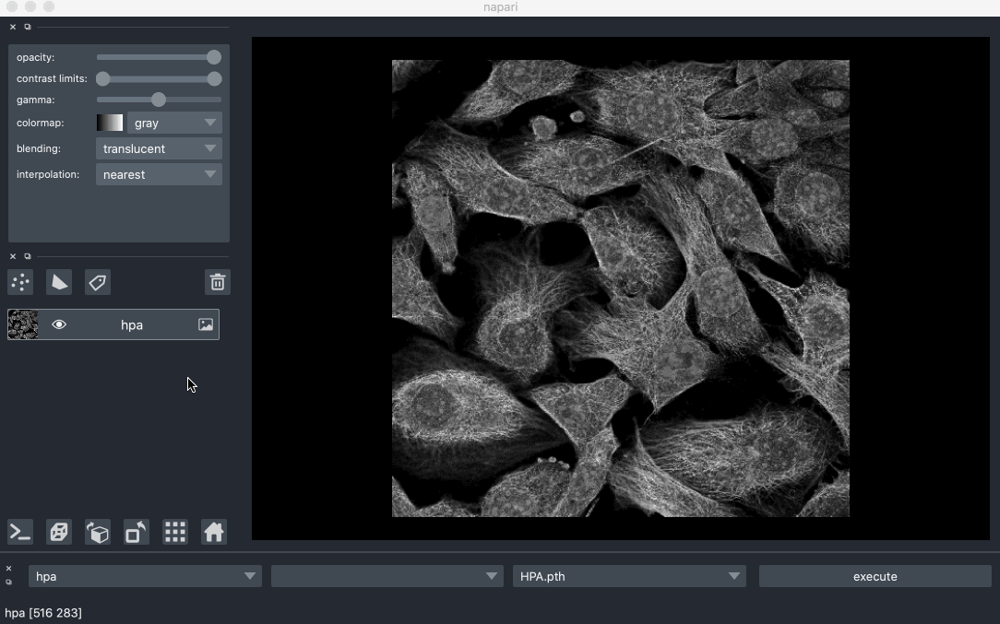
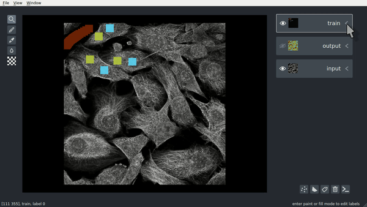
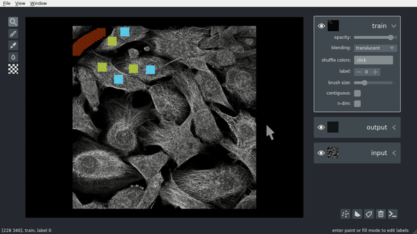
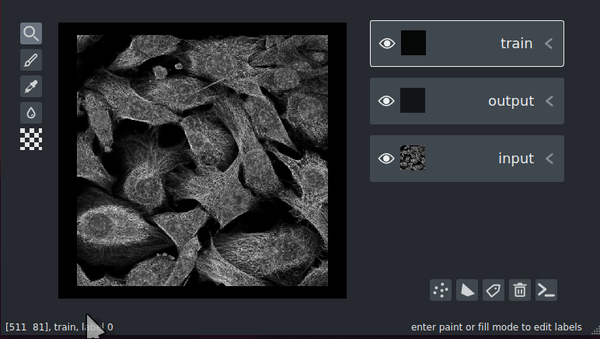
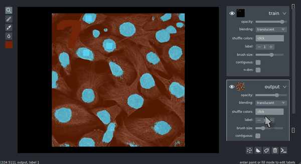
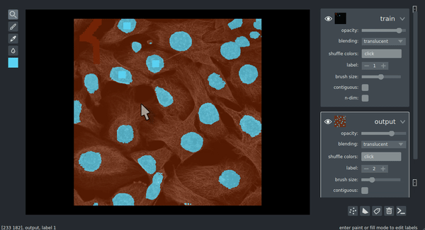
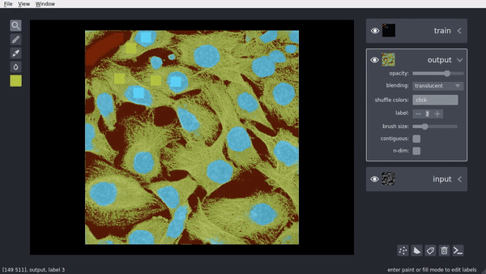

# Segmentify

Segmentify is an interactive and general purpose cell segmentation plugin for the multi-dimentional image viewer [Napari](https://github.com/napari/napari).

 <p align=center"></p>

In the example above, the user is using segmentify to segment out the nucleus, cytoplasm and the background for all the cells in the image. The user uses the paint brush tool to label some training examples on the **labels layer**. The entire image is featurized using a pretrained featurizer, and the selected examples are used to train a Random Forest Classifier. Lastly, the trained classifier is used to predict the label for all the remaining unlabeled pixels, and the segmentation output is displayed at the **segmentation labels layer**.

Segmentify uses [magicgui](https://magicgui.readthedocs.io/en/latest/) to automatically generate a GUI element that can be
used to select which layer will be the input layer, and which layer will provide the training labels.

## Installation

Segmentify can be installed using **pip**

```
pip install segmentify
```

## Adding Segmentify to napari

To add `segmentify` functionality to napari in a script you can do the following:

```python
import napari
from segmentify import segmentation

with napari.gui_qt():
    viewer = napari.Viewer()

    # instantiate the segmentify widget
    gui = segmentation.Gui()

    # add the new widget to the napari viewer
    viewer.window.add_dock_widget(gui)

    # keep the dropdown menus in the gui in sync with the layer model
    viewer.layers.events.changed.connect(lambda x: gui.refresh_choices())
```

An example can be found [here](./examples/launch.py)

## Featurization

Segmentify works by featurizing input images using either pretrained UNet models or some classical image filters. Users can then use the paint brush to label some of the pixels to train a Random Forest Classifier. The trained classifier is used to predict the label for all remaining unlabeled pixels. The training labels should be provided in the **train layer** and the segmentation will be displayed on the **output layer**. Segmentify includes the following featurization strategies:
- HPA\_4: Trained by decomposing images from the [Human Protein Atlas](https://www.kaggle.com/c/human-protein-atlas-image-classification) into Nucleus, ER, Protein and Cytoplasm
- HPA\_3: Trained by decomposing images from the [Human Protein Atlas](https://www.kaggle.com/c/human-protein-atlas-image-classification) into Nucleus, ER, Cytoplasm
- HPA: Trained by segmenting out the nucleus in images from the [Human Protein Atlas](https://www.kaggle.com/c/human-protein-atlas-image-classification)

- Nuclei: Trained by segmenting out the nucleus in images from the [Kaggle Data Science Bowl 2018](https://www.kaggle.com/c/data-science-bowl-2018/overview)
- Filter: Combining several classical image filter (Gaussian, Sobel, Laplace, Gabor, Canny)

For more information about the training strategies for each featurizer, please refer to the notebooks [here](https://github.com/marshuang80/CellSegmentation/tree/master/notebooks)

### Training your own featurizer

Users can also train their own image featurizers using [Cell Segmentation](https://github.com/marshuang80/CellSegmentation). The trained model should be placed in the *./segmentify/model/saved_model* directory.

## Key Bindings

The following is a list of Segmentify supported functions along with their key bindings:
- Dilation (Shift-D)
- Erosion (Shift-E)
- Close (Shift-C)
- Open (Shift-O)
- Fill holes (Shift-F)

> For all image morphology steps (dilation, erosion, close, open, fill holes), **the operations will only be applied to the selected label for the selected layer**. For example, if you want the blue labels in the segmented images to dilate, you will have to click on the *output layer* and increment to the desired label.

| Morphology on labels | Morphology on segmentation |
| --- | --- |
|  |  |


### Next Featurizer (Shift-N)

This feature cycles through all the featurizers in *segmentify/model/saved_model* as well as the filter featurizer. The name of the selected featurizer is shonw in the bottom left corner of the viewer. Note that after switching to the next featurizer, the user still needs to press Shift-S to re-segment the image.



### Dilation (Shift-D)

The [dilation operation](https://homepages.inf.ed.ac.uk/rbf/HIPR2/dilate.htm) expands all connected components with the selected label.



### Erosion (Shift-E)

The [erosion operation](https://homepages.inf.ed.ac.uk/rbf/HIPR2/erode.htm) shrinks all connected components with the selected label.



### Fill Holes (Shift-F)

This operation fills holes within a connected component for the selected label.



### Close (Shift-C)

The [close operation](https://homepages.inf.ed.ac.uk/rbf/HIPR2/close.htm)is done by applying dilation on the connected components with the selected label, following by an erosion.

### Open (Shift-O)

The [open operation](https://homepages.inf.ed.ac.uk/rbf/HIPR2/open.htm) is done by applying erosion on the connected components with the selected label, following by an dilation.
